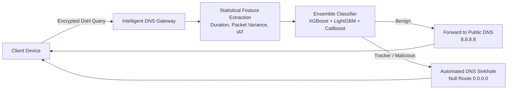

# Intelligent DNS Resolver: Machine Learning & DNS Sinkholing for Third-Party Tracking Mitigation

An intelligent, privacy-preserving DNS gateway that leverages ensemble machine learning to detect and neutralize third-party trackers and malicious flows within encrypted **DNS-over-HTTPS (DoH)** traffic without requiring SSL/TLS payload decryption.

---

## 👥 Authors & Affiliation

**School of Computer Science, Bina Nusantara (BINUS) University, Jakarta, Indonesia**
- **Achmad Rafif Zahran** (Lead Researcher) — *Computer Science Department* (`achmad.zahran@binus.ac.id`)
- **M Mario** (Data Analyst) — *Computer Science Department* (`m.mario@binus.ac.id`)
- **Ayu Maulina** — *Computer Science Department* (`ayu.maulina001@binus.ac.id`)
- **Rafi Putra Winata** (Supervising Professor) — *Computer Science Department* (`rafi.winata@binus.ac.id`)
- **Alfi Yusrotis Zakiyah** — *Mathematics & Statistics Department* (`alfi.zakiyyah@binus.edu`)

---

## 📌 Project Overview

The rapid adoption of encrypted DNS protocols, notably **DNS-over-HTTPS (DoH)**, presents a critical security paradox: while it protects user queries from ISP-level eavesdropping, it simultaneously creates an opaque tunnel that hides malicious third-party trackers, Command & Control (C2) communications, and DNS tunneling from traditional signature-based network defenses.

This project proposes and implements an **Intelligent DNS Resolver** that:
1. **Decryption-Free Classification:** Analyzes flow-level statistical metadata (packet length variance, flow duration, inter-arrival time) rather than inspecting encrypted payloads.
2. **Multi-Model Ensemble:** Combines **XGBoost**, **LightGBM**, and **CatBoost** using a weighted voting mechanism to achieve high-precision classification into *Benign* or *Tracker/Malicious*.
3. **Automated Real-Time Sinkholing:** Intercepts flagged queries at the network edge and returns a null address (`0.0.0.0`), immediately neutralizing tracker communication while forwarding benign traffic to trusted public resolvers (`8.8.8.8`).

---

## 🔬 Architecture & Workflow



---

## 📊 Key Results

Evaluated on the benchmark **CIC-DoHBrw-2020** dataset:

| Model | Accuracy | F1-Score | Inference Latency (ms) |
|---|---|---|---|
| **XGBoost** | **99.9%** | **0.999** | **0.0003 ms** |
| **CatBoost** | **99.9%** | **0.999** | **0.0004 ms** |
| **LightGBM** | **99.9%** | **0.999** | **0.0005 ms** |

- **Sub-millisecond inference:** The classification overhead is microsecond-level, ensuring real-time DNS resolution with zero perceptible user delay.
- **100% Integration Fidelity:** Tested against live traffic streams and well-known tracker domains (`google-analytics.com`, `doubleclick.net`), confirming zero false-positive routing for legitimate institutional queries (`binus.ac.id`).

---

## 📁 Repository Structure

```text
├── Experiment/
│   ├── experiment_script.py      # Benchmark training & latency evaluation for XGBoost, LightGBM, CatBoost
│   ├── sinkhole_logic.py         # Simulation of query handling and sinkhole decision logic
│   ├── sinkhole_testing.py       # Integration tests validating label-to-action synchronization
│   ├── realtime_traffic_demo.py  # Live traffic sniffing and classification via Wi-Fi network interface
│   ├── sizecutter.py             # Dataset preprocessing and sample slicing utility
│   ├── check_net.py              # Network interface diagnostic script
│   └── CIC_DoH_Small_Sample.csv  # Benchmark evaluation sample dataset
├── Draft_RM_Paraphrased.docx     # Complete research paper manuscript
├── Draft R&M (1).pdf             # Draft paper PDF
├── Poster RM .png                # Research presentation poster
├── requirements.txt              # Python dependencies
└── README.md                     # Project documentation
```

---

## 🚀 Getting Started

### 1. Prerequisites
- Python 3.10+
- [Npcap](https://npcap.com/) (required on Windows for Scapy live packet sniffing)

### 2. Installation
Clone the repository and install required Python packages:

```bash
git clone https://github.com/RafifZahran/intelligent-dns-resolver.git
cd intelligent-dns-resolver
pip install -r requirements.txt
```

### 3. Running Experiments

- **Train and benchmark ensemble models:**
  ```bash
  cd Experiment
  python experiment_script.py
  ```

- **Run automated sinkhole integration tests:**
  ```bash
  python sinkhole_testing.py
  ```

- **Test domain sinkhole decision simulation:**
  ```bash
  python sinkhole_logic.py
  ```

- **Run real-time network sniffing demo (requires admin privileges):**
  ```bash
  python realtime_traffic_demo.py
  ```

---

## 📄 Dataset Reference

This study utilizes the **CIC-DoHBrw-2020** dataset curated by the **Canadian Institute for Cybersecurity (CIC)** at the University of New Brunswick:
- Repository: [CIC-DoHBrw-2020 Dataset](https://www.unb.ca/cic/datasets/dohbrw-2020.html)

---

## 📝 License

This project is created for academic research at Bina Nusantara University. All rights reserved.
